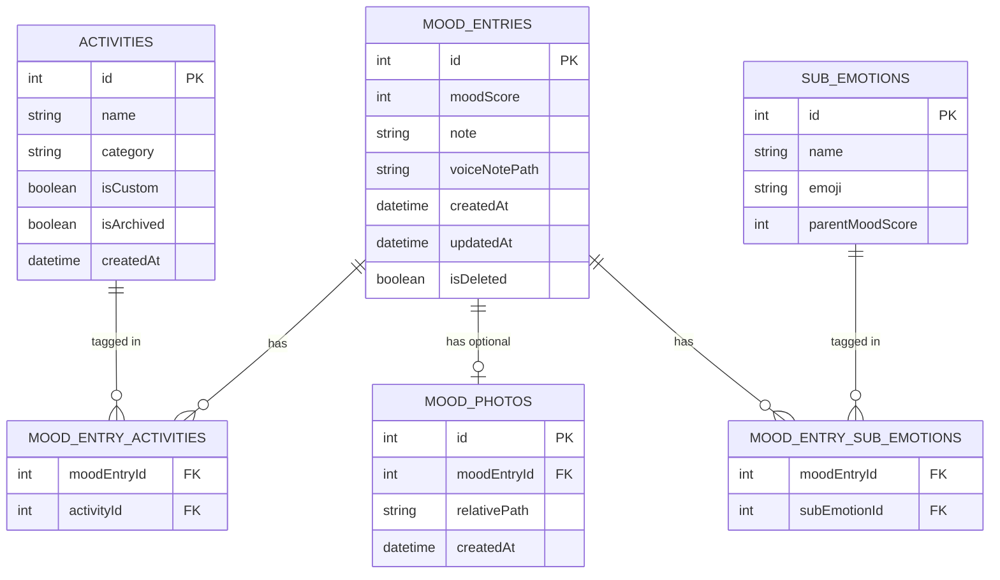

# Data Model & ERD

## "Daily Mood: Tracker & Diary"

**Database Engine:** SQLite (via Drift), encrypted with SQLCipher
**Scope:** Entire local schema, no tables sync to a server (MVP offline-only)

---

## 1. Entity Relationship Diagram (ERD)

> This `.mermaid` file can be opened directly with a Mermaid-compatible tool (GitHub, VSCode extension, or mermaid.live) to view it visually.

---

## 2. Table Details

### 2.1 `MoodEntries`

The central table, storing each mood log entry.

| Column          | Data Type | Constraints               | Notes                                                                                                               |
| --------------- | --------- | ------------------------- | ------------------------------------------------------------------------------------------------------------------- |
| `id`            | INTEGER   | PRIMARY KEY AUTOINCREMENT |                                                                                                                     |
| `moodScore`     | INTEGER   | NOT NULL, CHECK (1–5)     | 1 = Awful ... 5 = Excellent                                                                                         |
| `note`          | TEXT      | NULLABLE                  | Free-form journal note, optional                                                                                    |
| `createdAt`     | DATETIME  | NOT NULL                  | Creation timestamp, used for timeline display                                                                       |
| `updatedAt`     | DATETIME  | NOT NULL                  | Used to resolve conflicts during import/restore                                                                     |
| `isDeleted`     | BOOLEAN   | DEFAULT false             | Soft-delete, to avoid data loss from accidental deletion; actual cleanup happens periodically (e.g., after 30 days) |
| `voiceNotePath` | TEXT      | NULLABLE                  | Relative path of the audio recording file within the app sandbox, e.g.: `mood_voices/{uuid}.m4a`                    |

**Recommended index:**

- `INDEX idx_mood_entries_createdAt ON MoodEntries(createdAt)` — required, since the dashboard and calendar heatmap always query by date range.
- `INDEX idx_mood_entries_isDeleted ON MoodEntries(isDeleted)` — speeds up filtering of non-deleted records.

---

### 2.2 `Activities`

List of activity tags (default + custom).

| Column       | Data Type | Constraints                         | Notes                                                                                           |
| ------------ | --------- | ----------------------------------- | ----------------------------------------------------------------------------------------------- |
| `id`         | INTEGER   | PRIMARY KEY AUTOINCREMENT           |                                                                                                 |
| `name`       | TEXT      | NOT NULL, UNIQUE, max 20 characters | No emoji allowed (to avoid breaking chip layout)                                                |
| `category`   | TEXT      | NOT NULL                            | Enum: `Health`, `Life`, `Other`                                                                 |
| `isCustom`   | BOOLEAN   | DEFAULT false                       | Distinguishes default tags (seed data) from user-created tags                                   |
| `isArchived` | BOOLEAN   | DEFAULT false                       | Allows "hiding" rarely-used tags instead of deleting them (preserves historical data integrity) |
| `createdAt`  | DATETIME  | NOT NULL                            |                                                                                                 |

**Default seed data (isCustom = false):** `Work`, `Exercise`, `Social`, `Sleep`, `Nutrition`, `Family`, `Hobbies`.

**Business rule:** Maximum of 30 custom tags per user (enforced at the application layer, not a DB constraint).

---

### 2.3 `MoodEntryActivities` (Junction Table)

Many-to-many relationship between entries and activity tags.

| Column        | Data Type | Constraints                            | Notes                                                                |
| ------------- | --------- | -------------------------------------- | -------------------------------------------------------------------- |
| `moodEntryId` | INTEGER   | FK → MoodEntries.id, ON DELETE CASCADE |                                                                      |
| `activityId`  | INTEGER   | FK → Activities.id, ON DELETE RESTRICT | Cannot delete an activity that is currently in use — only archive it |
|               |           | PRIMARY KEY (moodEntryId, activityId)  | Composite key, prevents duplicates                                   |

> **Reason for using `ON DELETE RESTRICT` on activityId:** if a user permanently deletes an activity attached to an old entry, the historical data would lose context. Instead, use `isArchived = true` to hide it from the selection list for new entries while keeping it intact in old entries.

---

### 2.4 `MoodPhotos`

Stores a reference to attached photos (actual images are stored in the file system, not as a blob in the DB).

| Column         | Data Type | Constraints                                    | Notes                                                                                            |
| -------------- | --------- | ---------------------------------------------- | ------------------------------------------------------------------------------------------------ |
| `id`           | INTEGER   | PRIMARY KEY AUTOINCREMENT                      |                                                                                                  |
| `moodEntryId`  | INTEGER   | FK → MoodEntries.id, ON DELETE CASCADE, UNIQUE | Maximum of 1 photo per entry in the MVP                                                          |
| `relativePath` | TEXT      | NOT NULL                                       | Relative path within the app sandbox, e.g. `mood_photos/{uuid}.jpg` — do NOT store absolute path |
| `createdAt`    | DATETIME  | NOT NULL                                       |                                                                                                  |

### 2.5 `SubEmotions`

Catalog of detailed emotions belonging to the 5 main Mood groups (static seed data)[cite: 5].

| Column            | Data Type | Constraints               | Notes                                                            |
| ----------------- | --------- | ------------------------- | ---------------------------------------------------------------- |
| `id`              | INTEGER   | PRIMARY KEY AUTOINCREMENT |                                                                  |
| `name`            | TEXT      | NOT NULL, UNIQUE          | Examples: Excited, Confused, Guilty, Proud, Disappointed...      |
| `emoji`           | TEXT      | NOT NULL                  | Emoji character or Asset Icon code used for UI display           |
| `parentMoodScore` | INTEGER   | NOT NULL, CHECK (1–5)     | Direct link indicating which main mood group (1-5) it belongs to |

### 2.6 `MoodEntrySubEmotions` (Junction Table)

Many-to-many relationship between log entries (`MoodEntries`) and detailed emotions (`SubEmotions`)[cite: 5].

| Column         | Data Type | Constraints                             | Notes                                       |
| -------------- | --------- | --------------------------------------- | ------------------------------------------- |
| `moodEntryId`  | INTEGER   | FK → MoodEntries.id, ON DELETE CASCADE  |                                             |
| `subEmotionId` | INTEGER   | FK → SubEmotions.id, ON DELETE CASCADE  |                                             |
|                |           | PRIMARY KEY (moodEntryId, subEmotionId) | Composite key, prevents duplicates[cite: 5] |

**Photo file handling rules:**

- Photos are resized to a maximum of 1080px on the long edge, compressed to ~80% quality before saving.
- When `MoodEntries` are deleted (hard delete after soft-delete cleanup), the corresponding physical image files must also be deleted — requires a transaction/hook to ensure no orphaned files are left behind.

---

## 3. Migration Strategy

- Use Drift's schema versioning (`schemaVersion` incrementing), with explicit migration scripts written for each version step — never use `destructive migration` (drop & recreate) under any circumstances after release, since it would cause user data loss.
- Each migration needs its own test: create a DB at the old version with sample data → run the migration → assert that no data is lost and no types are incorrect.

---

## 4. Conflict Strategy for Import/Restore

Applies to both `MoodEntries` and `Activities` when a user imports a backup file:

1. Compare using a **logical UUID key** (not the auto-incrementing `id`, since it can differ between 2 devices) — recommend adding a `uuid TEXT UNIQUE` column to `MoodEntries` and `Activities` to serve as the comparison key during import, instead of relying solely on `id`.
2. If the `uuid` doesn't exist yet → insert as new.
3. If the `uuid` already exists and the `updatedAt` in the new file is more recent than the current record → overwrite.
4. If the `updatedAt` in the file is older → keep the existing record, log the skipped records so the user can review them.
5. Always create an automatic backup snapshot **before** performing an import, stored temporarily in `core/utils/backup_snapshots/`, keeping a maximum of the 3 most recent snapshots.

> **Update from the original schema:** a `uuid` column should be added to both `MoodEntries` and `Activities` right from Phase 1, even though the MVP doesn't need sync yet — because adding it later (once user data already exists) would be far more complex than adding it from the start.

---

## 5. Summary of Questions to Finalize Before Coding

- Will multiple photos per entry be allowed in a later version? (This affects the design of the `MoodPhotos` table — currently 1-to-1, so consider designing for 1-to-many from the start to avoid migrating later.)
- What is the retention threshold for `isDeleted = true` records before permanent deletion?
