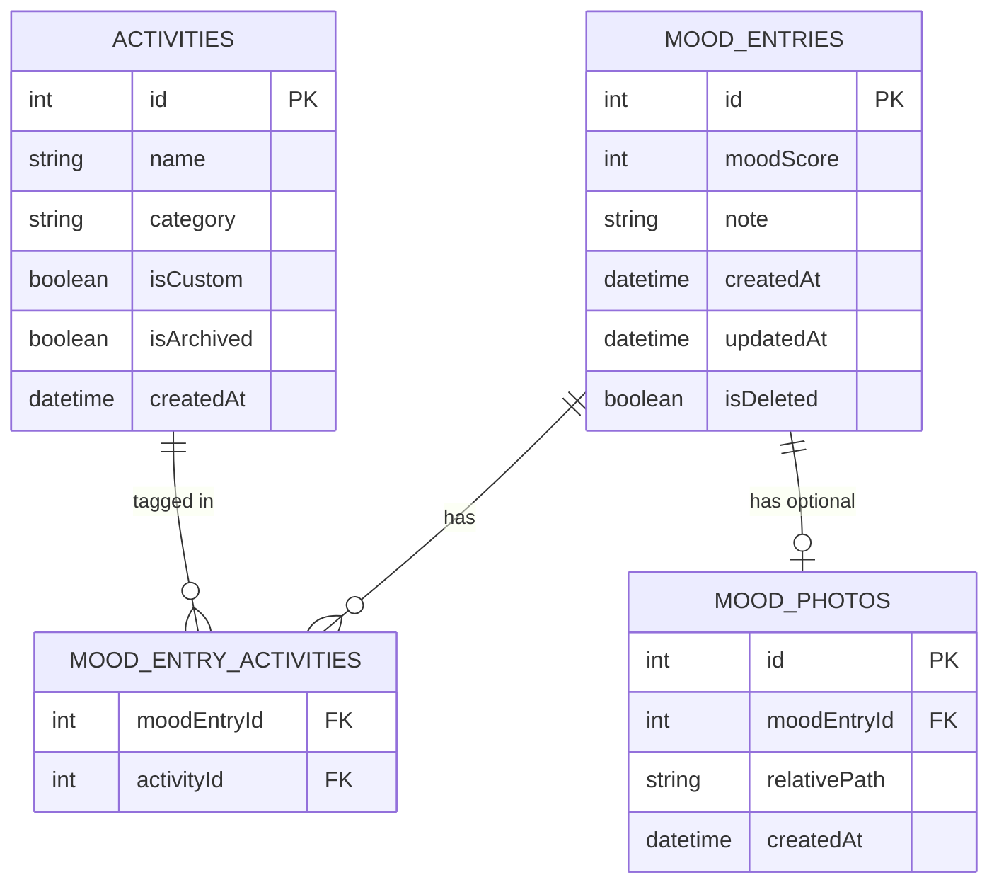

# Data Model & ERD

## "Daily Mood: Tracker & Diary"

**Database Engine:** SQLite (qua Drift), mã hóa bằng SQLCipher
**Phạm vi:** Toàn bộ schema local, không có bảng nào đồng bộ server (MVP offline-only)

---

## 1. Sơ đồ quan hệ (ERD)

> File `.mermaid` này có thể mở trực tiếp bằng công cụ hỗ trợ Mermaid (GitHub, VSCode extension, hoặc mermaid.live) để xem dạng sơ đồ trực quan.

---

## 2. Chi tiết từng bảng

### 2.1 `MoodEntries`

Bảng trung tâm, lưu mỗi lần log mood.

| Cột         | Kiểu dữ liệu | Ràng buộc                 | Ghi chú                                                                                         |
| ----------- | ------------ | ------------------------- | ----------------------------------------------------------------------------------------------- |
| `id`        | INTEGER      | PRIMARY KEY AUTOINCREMENT |                                                                                                 |
| `moodScore` | INTEGER      | NOT NULL, CHECK (1–5)     | 1 = Awful ... 5 = Excellent                                                                     |
| `note`      | TEXT         | NULLABLE                  | Nhật ký tự do, optional                                                                         |
| `createdAt` | DATETIME     | NOT NULL                  | Thời điểm tạo, dùng để hiển thị timeline                                                        |
| `updatedAt` | DATETIME     | NOT NULL                  | Dùng để giải quyết conflict khi import/restore                                                  |
| `isDeleted` | BOOLEAN      | DEFAULT false             | Soft-delete, tránh mất dữ liệu khi user xóa nhầm; dọn dẹp thật sự theo chu kỳ (vd. sau 30 ngày) |

**Index đề xuất:**

- `INDEX idx_mood_entries_createdAt ON MoodEntries(createdAt)` — bắt buộc, vì dashboard và calendar heatmap luôn query theo khoảng ngày.
- `INDEX idx_mood_entries_isDeleted ON MoodEntries(isDeleted)` — tăng tốc lọc bản ghi chưa xóa.

---

### 2.2 `Activities`

Danh sách tag hoạt động (mặc định + custom).

| Cột          | Kiểu dữ liệu | Ràng buộc                      | Ghi chú                                                                  |
| ------------ | ------------ | ------------------------------ | ------------------------------------------------------------------------ |
| `id`         | INTEGER      | PRIMARY KEY AUTOINCREMENT      |                                                                          |
| `name`       | TEXT         | NOT NULL, UNIQUE, max 20 ký tự | Không cho emoji (tránh vỡ layout chip)                                   |
| `category`   | TEXT         | NOT NULL                       | Enum: `Health`, `Life`, `Other`                                          |
| `isCustom`   | BOOLEAN      | DEFAULT false                  | Phân biệt tag mặc định (seed data) và tag user tự tạo                    |
| `isArchived` | BOOLEAN      | DEFAULT false                  | Cho phép "ẩn" tag ít dùng thay vì xóa hẳn (giữ toàn vẹn dữ liệu lịch sử) |
| `createdAt`  | DATETIME     | NOT NULL                       |                                                                          |

**Seed data mặc định (isCustom = false):** `Work`, `Exercise`, `Social`, `Sleep`, `Nutrition`, `Family`, `Hobbies`.

**Giới hạn nghiệp vụ:** Tối đa 30 custom tags/user (kiểm tra ở tầng application, không phải DB constraint).

---

### 2.3 `MoodEntryActivities` (Junction Table)

Quan hệ nhiều-nhiều giữa entry và activity tag.

| Cột           | Kiểu dữ liệu | Ràng buộc                              | Ghi chú                                                 |
| ------------- | ------------ | -------------------------------------- | ------------------------------------------------------- |
| `moodEntryId` | INTEGER      | FK → MoodEntries.id, ON DELETE CASCADE |                                                         |
| `activityId`  | INTEGER      | FK → Activities.id, ON DELETE RESTRICT | Không cho xóa activity nếu đang được dùng — chỉ archive |
|               |              | PRIMARY KEY (moodEntryId, activityId)  | Composite key, tránh trùng lặp                          |

> **Lý do dùng `ON DELETE RESTRICT` cho activityId:** nếu user xóa hẳn 1 activity đang gắn với entry cũ, dữ liệu lịch sử sẽ mất ngữ cảnh. Thay vào đó dùng `isArchived = true` để ẩn khỏi danh sách chọn mới nhưng vẫn giữ nguyên trong entry cũ.

---

### 2.4 `MoodPhotos`

Lưu reference đến ảnh đính kèm (ảnh thật lưu trong file system, không lưu blob trong DB).

| Cột            | Kiểu dữ liệu | Ràng buộc                                      | Ghi chú                                                                                       |
| -------------- | ------------ | ---------------------------------------------- | --------------------------------------------------------------------------------------------- |
| `id`           | INTEGER      | PRIMARY KEY AUTOINCREMENT                      |                                                                                               |
| `moodEntryId`  | INTEGER      | FK → MoodEntries.id, ON DELETE CASCADE, UNIQUE | 1 entry tối đa 1 ảnh ở MVP                                                                    |
| `relativePath` | TEXT         | NOT NULL                                       | Đường dẫn tương đối trong sandbox app, vd. `mood_photos/{uuid}.jpg` — KHÔNG lưu absolute path |
| `createdAt`    | DATETIME     | NOT NULL                                       |                                                                                               |

**Quy tắc xử lý file ảnh:**

- Ảnh được resize về tối đa 1080px cạnh dài, nén chất lượng ~80% trước khi lưu.
- Khi xóa `MoodEntries` (hard delete sau soft-delete cleanup), phải xóa luôn file ảnh vật lý tương ứng — cần transaction/hook đảm bảo không để file mồ côi (orphaned file).

---

## 3. Chiến lược Migration

- Dùng Drift's schema versioning (`schemaVersion` tăng dần), viết migration script tường minh cho từng bước tăng version — không dùng `destructive migration` (drop & recreate) trong bất kỳ trường hợp nào sau khi đã release, vì sẽ mất dữ liệu user.
- Mỗi migration cần có test riêng: tạo DB ở version cũ với sample data → chạy migration → assert dữ liệu không mất, không sai kiểu.

---

## 4. Chiến lược Conflict khi Import/Restore

Áp dụng cho cả `MoodEntries` và `Activities` khi user import file backup:

1. So sánh theo **UUID logic key** (không dùng `id` tự tăng vì có thể lệch giữa 2 thiết bị) — khuyến nghị bổ sung cột `uuid TEXT UNIQUE` vào `MoodEntries` và `Activities` để làm khóa đối chiếu khi import, thay vì chỉ dựa vào `id`.
2. Nếu `uuid` chưa tồn tại → insert mới.
3. Nếu `uuid` đã tồn tại và `updatedAt` trong file mới hơn bản hiện tại → ghi đè.
4. Nếu `updatedAt` trong file cũ hơn → giữ nguyên, ghi log các bản bị bỏ qua để hiển thị cho user xem lại.
5. Luôn tạo bản snapshot backup tự động **trước khi** thực hiện import, lưu tạm trong `core/utils/backup_snapshots/`, giữ tối đa 3 bản gần nhất.

> **Cập nhật so với schema ban đầu:** nên thêm cột `uuid` vào cả `MoodEntries` và `Activities` ngay từ Phase 1, dù MVP chưa cần sync — vì thêm sau này (khi đã có user data) sẽ phức tạp hơn nhiều so với thêm từ đầu.

---

## 5. Tổng hợp câu hỏi cần chốt trước khi code

- Có cho phép nhiều ảnh/entry ở version sau không? (Ảnh hưởng thiết kế bảng `MoodPhotos` — hiện đang là 1-1, nên cân nhắc thiết kế 1-nhiều ngay từ đầu để đỡ migrate sau).
- Ngưỡng thời gian giữ bản ghi `isDeleted = true` trước khi xóa vĩnh viễn là bao lâu?
